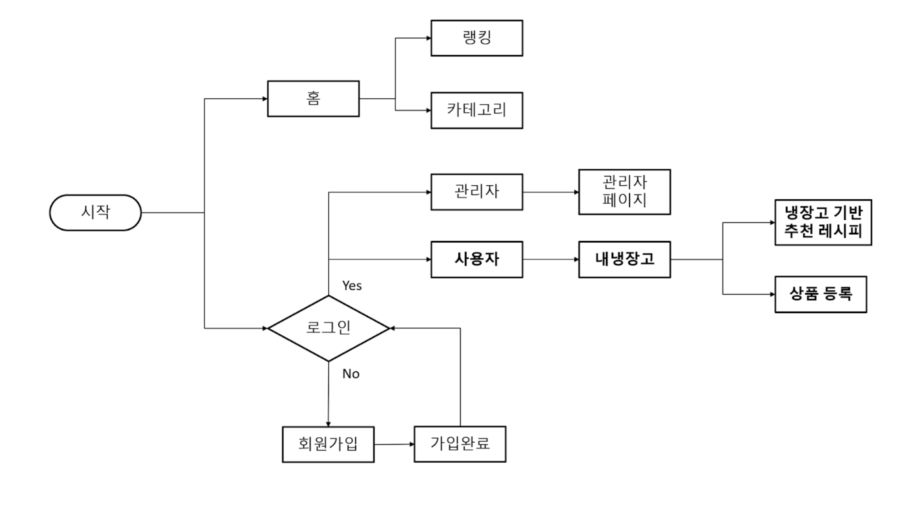
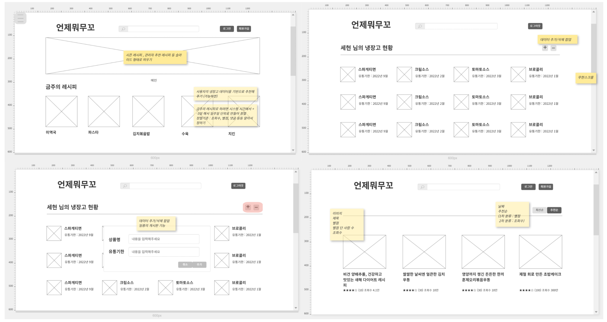
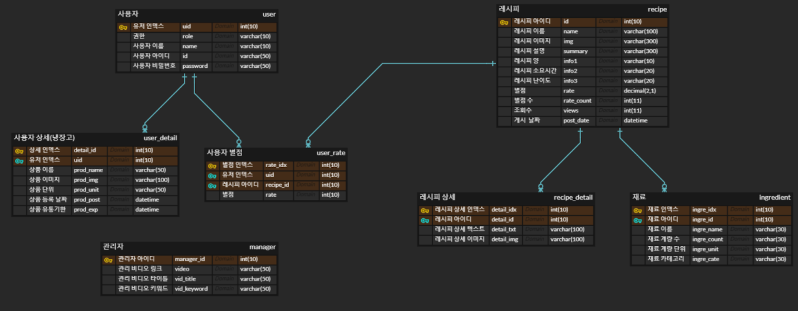

# WhenWhatEat
## 
## 시연 영상

--- 

## 프로젝트 설명

---
## 프로젝트 설계
    프로젝트 기간 : 2022-01-10 ~ 2022-01-27
    멤버구성 :프론트엔드 1명 | 백엔드 1명 | 데이터베이스 1명

|기능설계|화면설계|ERD설계|
|------|---|---|
||||

---

## 기술스택
|기술명|버전|
|------|---|
|Vue|2|
|Spring|5.0.7|
|Tomcat|9|
|Java|11|
|AWS (EC2,RDS)|
|Azure (Virtual Machine)|

